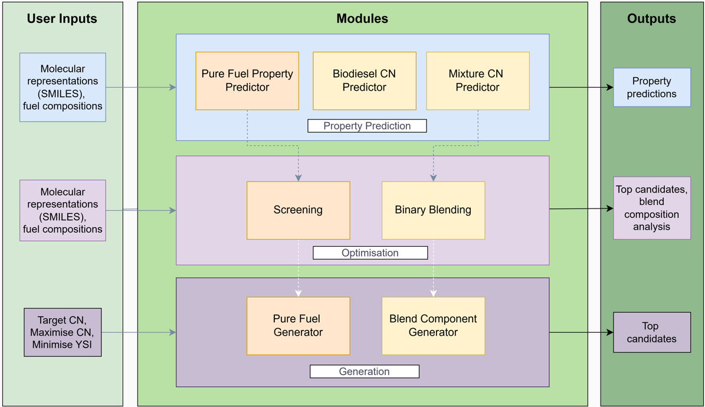

# Predicting Optimal Biofuel Composition Using Machine Learning

This project aims to develop a machine learning (ML)-based model for predicting the best 
biofuel compositions tailored for certain applications and engine types. With the world turning 
towards green energy, biofuels represent an acceptable substitute for fossil fuels. However, it 
takes time and is costly to experiment to determine the best combination of bio-components 
such as ethanol, biodiesel, and other biomass-derived fuels. By applying data-driven 
approaches, the project seeks to improve the process of finding compositions that achieve 
efficiency maximisation, emissions minimisation, and maintaining engine performance. 

The system will use the past record of fuel compositions, combustion properties, and engine 
performance parameters to train supervised machine learning algorithms. The algorithm will 
learn to map certain fuel compositions to target output values (e.g. energy density, emissions 
profile, ignition delay). The aim is to create a predictive model that can suggest biofuel 
compositions for specific constraints or applications, e.g. heavy transport, air transport, power 
generation. This study has the potential to speed up greener fuel adoption and aid in 
decarbonisation efforts in different industries.

## 📋 Table of Contents

- [Project Overview](#-project-overview)
- [Project Structure](#-project-structure)
- [Key Components](#-key-components)
- [Installation](#-installation)
- [Usage](#-usage)
- [Current Status](#-current-status)
- [References](#-references)

---

## Project Overview

This project develops **AI-powered tools** for designing optimal biofuel molecules that address the critical challenge of balancing multiple fuel properties:

- **Cetane Number (CN)**: Combustion quality
- **Yield Sooting Index (YSI)**: Soot formation (environmental impact)

Constraints:
- **Physical Properties**: Boiling point, Density, Lower heating value, Dynamic viscosity



## 📁 Project Structure
```
Biofuel-Optimiser-ML/
│
├── core/                              # Shared core functionality
│   ├── predictors/                    # Property prediction models
│   │   ├── pure_component/            # ML model predictor logic for pure molecules
│   │   │   ├── generic.py             # Generic predictor wrapper
│   │   │   ├── property_predictor.py  # Batch prediction with optimisation
│   │   │   └── hf_models.py           # Hugging Face model predictor paths
│   │   │
│   │   └── mixture/                   # GNN models for fuel mixtures
│   │       ├── mixture_dcn_predictor.py  # MolPool GNN ensemble for mixture DCN
│   │       ├── inp.py                    # Training argument dataclasses
│   │       └── solvation_predictor/      # MPNN model architecture (see References)
│   │
│   ├── evolution/                    # Genetic algorithm components
│   │   ├── molecule.py               # Molecule dataclass with fitness
│   │   ├── population.py             # Population management & Pareto fronts
│   │   ├── evolution.py              # Main evolutionary algorithm (pure component)
│   │   ├── mixture_evolution.py      # Mixture-aware evolutionary algorithm
│   │   ├── applicability_domain.py   # One-Class SVM applicability domain checker
│   │   └── anomaly_detection.py      # Ensemble uncertainty filter
│   │
│   ├── blending/                     # Fuel blending laws
│   │   └── blending_law.py           # Riazi-Daubert BP, mass-weighted YSI blending
│   │
│   ├── base_fuel_library.py          # Pre-defined fossil diesel & biodiesel compositions
│   ├── config.py                     # Configuration dataclasses
│   ├── data_prep.py                  # Data loading utilities
│   └── shared_features.py            # Molecular featurisation (RDKit descriptors)
│
├── applications/                     # User-facing applications
│   ├── pure_predictor/               # Predict properties of pure molecules
│   │   ├── main.py
│   │   ├── cli.py
│   │   └── results.py
│   ├── molecule_generator/           # Generate pure-component additive molecules
│   │   ├── main.py
│   │   ├── cli.py
│   │   └── results.py
│   ├── mixture_predictor/            # Predict DCN of multi-component fuel mixtures
│   │   ├── main.py
│   │   ├── cli.py
│   │   └── results.py
│   ├── mixture_aware_generator/      # Generate additive molecules optimised for blends
│   │   ├── main.py
│   │   ├── cli.py
│   │   └── results.py
│   ├── binary_blending_tool/         # Sweep additive concentration across a base fuel
│   │   ├── main.py
│   │   ├── cli.py
│   │   └── results.py
│   ├── biodiesel_predictor/          # Predict CN of biodiesel from FAME composition
│   │   ├── main.py
│   │   ├── cli.py
│   │   ├── pipeline.py
│   │   ├── config.py
│   │   └── results.py
│   └── screening_tool/               # Screen a CSV of molecules/mixtures for target CN
│       ├── main.py
│       ├── cli.py
│       └── results.py
│
├── data/                              # Data files
│   ├── database/                      # SQLite databases
│   │   └── database_main.db           # Main molecular property database
│   │
│   └── fragments/                     # CREM fragment database for molecule mutation
│       └── diesel_fragments.db        # 2000 diesel-relevant fragments
│
├── models/                            # Trained model weights
│   ├── pure_component/                # 6 ML models (CN, YSI, BP, density, LHV, viscosity)
│   │   ├── cn_predictor_model/
│   │   ├── ysi_predictor_model/
│   │   ├── bp_predictor_model/
│   │   ├── density_predictor_model/
│   │   ├── lhv_predictor_model/
│   │   └── dynamic_viscosity_predictor_model/
│   │
│   └── mixture/                       # MolPool GNN ensemble (auto-downloaded from HF)
│
├── scripts/                           # Standalone run scripts
│   ├── run_pure_cn_ysi.py             # Run pure-component CN/YSI optimisation
│   └── run_mixture_cn_ysi.py          # Run mixture-aware CN/YSI optimisation
│
├── results/                           # Output files
│   ├── final_population.csv
│   ├── pareto_front.csv
│   └── ...
│
├── cache/                             # Cached intermediate predictions
│   └── mixture_dcn_cache.pkl
│
├── docker/                            # Docker deployment
│   ├── Dockerfile
│   ├── .dockerignore
│   └── docker-compose.yml
│
├── requirements.txt
└── README.md
```
---

## 🔑 Key Components Explained

### 1. **Core Module** (`core/`)

The foundation of the project containing all reusable logic.

#### **A. Predictors** (`core/predictors/`)

**Pure Component Predictors:**
- Predict 6 properties for individual molecules using ML models
- **Models**: Cetane Number, YSI, Density, Boiling Point, Dynamic Viscosity, LHV
- Hosted on Hugging Face Hub — auto-downloaded on first use

**Mixture Predictors:**
- **`mixture_dcn_predictor.py`**: MolPool GNN ensemble for predicting Derived Cetane Number (DCN) of multi-component fuel mixtures (up to 11 components)
- **`solvation_predictor/`**: MPNN-based model architecture adapted from the MolPool for Fuels Properties project (see [References](#-references)); handles graph-level message passing and feed-forward layers

#### **B. Evolution Module** (`core/evolution/`)

**Genetic Algorithm Components:**

1. **`molecule.py`**: Molecule dataclass
   - Stores SMILES, properties, fitness
   - Pareto dominance checking
   - Fitness calculation (single or multi-objective)

2. **`population.py`**: Population management
   - Survivor selection (top 50%)
   - Pareto front extraction
   - Duplicate prevention

3. **`evolution.py`**: Pure-component algorithm
   - Initialization (stratified sampling from training data)
   - Mutation (CREM-based chemical modifications)
   - Fitness evaluation (batch processing)
   - Constraint filtering

4. **`mixture_evolution.py`**: Mixture-aware algorithm
   - Evaluates fitness in the context of a base fuel blend
   - Uses the MolPool GNN for mixture DCN fitness

5. **`applicability_domain.py`**: One-Class SVM AD checker
   - Trained on GNN embeddings from the training set
   - Flags molecules outside the model's applicability domain

6. **`anomaly_detection.py`**: Ensemble uncertainty filter
   - Uses ExtraTreesRegressor variance to identify unreliable predictions

**Algorithm Flow (Pure Component):**
```
1. Initialize: 600 diverse molecules → Filter → 100 valid
2. Loop (6 generations):
   a. Select top 50% survivors (Pareto front + best remainder)
   b. Each survivor → 5 mutations (CREM)
   c. Batch predict properties
   d. Filter by constraints
   e. Form new population
3. Output: Final population + Pareto front
```

#### **C. Blending Module** (`core/blending/`)

- **`blending_law.py`**: Physical blending rules for mixtures
  - Riazi-Daubert correlation for mixture boiling point (from component molecular weights and densities)
  - Mass-weighted additive blending for YSI

#### **D. Shared Features** (`core/shared_features.py`)

- Converts SMILES → 200+ RDKit molecular descriptors
- Feature selection (removes low-variance and correlated features)
- Optimised for batch processing

#### **E. Base Fuel Library** (`core/base_fuel_library.py`)

- Pre-defined compositions for fossil diesel and biodiesel (SMILES + mole fractions)
- Used by the mixture-aware generator and binary blending tool

---

### 2. **Applications** (`applications/`)

User-facing tools that combine core components.

#### **Application 1: Pure Component Property Predictor**

**Purpose:** Predicts all 6 properties (CN, YSI, BP, Density, LHV, Dynamic Viscosity) from the SMILES of a pure molecule.

**Usage:**
```bash
python -m applications.pure_predictor.main

# Interactive prompts:
# - Single or Batch Prediction: 1 or 2
# - Input SMILES
# - Outputs property predictions
```

---

#### **Application 2: Molecule Generator (Pure Component)**

**Purpose:** Generates molecules optimised for a target cetane number using a genetic algorithm, with optional YSI minimisation.

**Features:**
- **Two optimization modes:** Target CN (minimize error) or Maximize CN
- **Multi-objective:** Optionally minimize YSI (NSGA-II Pareto search)
- **Constraints:** BP, density, LHV, viscosity all within fuel specifications
- **Pareto optimization:** Extract non-dominated solutions

**Usage:**
```bash
python -m applications.molecule_generator.main

# Interactive prompts:
# - Optimization mode: target CN or maximize CN
# - Target CN (e.g. 50)
# - Minimize YSI: y/n
# - Runs 6 generations with 100 molecules
```

**Output:**
- `results/final_population.csv`: All molecules ranked by fitness
- `results/pareto_front.csv`: Optimal CN vs YSI trade-offs

---

#### **Application 3: Mixture DCN Predictor**

**Purpose:** Predicts the Derived Cetane Number (DCN) of a user-defined multi-component fuel mixture using the MolPool GNN ensemble.

**Features:**
- Accepts 2–11 mixture components
- Validates SMILES input and mole fractions (auto-normalised to sum to 1.0)
- Auto-downloads GNN weights from HuggingFace on first use

**Usage:**
```bash
python -m applications.mixture_predictor.main

# Interactive prompts:
# - Number of components (2–11)
# - SMILES and mole fraction for each component
# - Outputs predicted mixture DCN
```

---

#### **Application 4: Mixture-Aware Molecule Generator**

**Purpose:** Generates novel additive molecules optimised for mixture DCN/YSI when blended into a base fuel at a fixed mole fraction.

**Features:**
- **Two optimization modes:** Target mixture DCN or maximize mixture DCN
- **Base fuel options:** Fossil diesel, biodiesel, or custom (user-defined SMILES + fractions)
- **Multi-objective:** Optionally minimize mixture YSI (NSGA-II)
- **Configurable additive fraction:** Specify the additive mole fraction (e.g. 0.10 for 10%)

**Usage:**
```bash
python -m applications.mixture_aware_generator.main

# Interactive prompts:
# - Optimization mode (target / maximize DCN)
# - Target mixture DCN
# - Base fuel type (fossil diesel / biodiesel / custom)
# - Additive mole fraction
# - Minimize mixture YSI: y/n
```

---

#### **Application 5: Binary Blending Tool**

**Purpose:** Sweeps a single additive molecule across a range of mole fractions blended into a base fuel, showing how mixture DCN and YSI change with concentration.

**Features:**
- Configurable sweep range and number of steps
- Base fuel options: fossil diesel, biodiesel, or custom composition
- Outputs a concentration–property curve

**Usage:**
```bash
python -m applications.binary_blending_tool.main

# Interactive prompts:
# - Additive SMILES
# - Base fuel type
# - Sweep range (min fraction, max fraction, number of steps)
```

---

#### **Application 6: Biodiesel CN Predictor**

**Purpose:** Predicts the cetane number of biodiesel from its Fatty Acid Methyl Ester (FAME) composition (% by weight).

**Features:**
- Accepts 34 FAME species (C4:0 through C24:0)
- Single-sample interactive input or CSV batch mode
- Validates composition (total 95–105%, C18:3 ≤ 12%, C18:2 < 70%)
- Out-of-distribution (OOD) flagging based on training feature ranges
- Uses a pre-trained external model (see [References](#-references))

**Usage:**
```bash
python -m applications.biodiesel_predictor.main

# Interactive prompts:
# - Prediction mode: single sample or CSV batch
# - FAME percentages (grouped by chain length)
# - Outputs predicted CN with OOD flag where applicable
```

---

#### **Application 7: Screening Tool**

**Purpose:** Screens a user-supplied CSV of candidate molecules or pre-defined mixtures against a target cetane number and property constraints, returning a ranked list and Pareto front.

**Features:**
- **Pure component mode:** Accepts a CSV with a `smiles` column; predicts all 6 pure-component properties; filters by BP, density, LHV, and viscosity constraints
- **Mixture mode:** Accepts a `mixture_database.csv`-format CSV; predicts mixture DCN (GNN) and mixture YSI (mass-weighted blending law)
- Outputs ranked candidates and Pareto front (CN error vs YSI) as CSV files

**Usage:**
```bash
python -m applications.screening_tool.main

# Interactive prompts:
# - Path to CSV file
# - Screening mode: pure component or mixture
# - Target CN
# - Property filter bounds (or use defaults)
```

**Output:**
- `results/screening_pure_filtered.csv` / `results/screening_mixture_all.csv`
- `results/screening_pure_pareto.csv` / `results/screening_mixture_pareto.csv`

---

### 3. **Models** (`models/pure_component/`)

Six trained ML models, each in its own directory:

| Property | Model Type | R² | Test MAE | Training Samples | Test Samples |
|----------|-----------|-----|-----|-----------------|-----|
| **Cetane Number (CN)** | ExtraTreesRegressor | 0.944 | 3.82 | 973 | 244 |
| **YSI** | ExtraTreesRegressor | 0.91 | 3.1 | 838 | 210 |
| **Boiling Point (BP)** | ExtraTreesRegressor | 0.9795 | 7.6 °C | 602 | 151 |
| **Density** | ExtraTreesRegressor | 0.99 | 8.0 kg/m³ | 561 | 141 |
| **LHV** | ExtraTreesRegressor | 0.9572 | 0.5096 MJ/kg | 486 | 122 |
| **Dynamic Viscosity** | ExtraTreesRegressor | 0.9776 | 21 cP | 522 | 130 |

**Each model directory contains:**
- `model.joblib`: Trained model weights
- `feature_importances.csv`: Top features ranked
- `evaluation_plots.png`: R², residuals, feature importance plots
- `test_predictions.csv`: Held-out test set predictions

---

### 4. **Data** (`data/`)

#### **A. Database** (`data/database/`)
- `database_main.db`: SQLite database with 1494 molecules
  - Pure component properties
  - Mixture data

#### **B. Fragments** (`data/fragments/`)
- `diesel_fragments.db`: CREM database with ~2000 molecular fragments
  - Extracted from diesel compounds
  - Ensures chemically realistic mutations
  - Maintains synthesizability

---

## 🚀 Installation

### Prerequisites
- Python 3.10

### Setup
```bash
# 1. Clone repository
git clone https://github.com/SalZa2004/Biofuel-Optimiser-ML.git
cd biofuel-ml

# 2. Create environment
conda create -n biofuel python=3.10
conda activate biofuel

# 3. Install dependencies
pip install -r requirements.txt

# 4. Install project in development mode
pip install -e .
```

## OR Docker Setup

### Prerequisites
- WSL
- Docker Engine

### Setup
```bash
# 1. Go to docker directory
cd docker

# 2. Build the docker image
docker compose build

# 3. Start up docker image
docker compose up -d

# 4. Execute docker
docker exec -it biofuel-ml bash
```

---

## 💻 Usage

### Quick Start
```bash
# Predict pure component properties
python -m applications.pure_predictor.main

# Generate optimised pure-component molecules
python -m applications.molecule_generator.main

# Predict mixture DCN
python -m applications.mixture_predictor.main

# Generate additive molecules optimised for blends
python -m applications.mixture_aware_generator.main

# Sweep an additive across a base fuel
python -m applications.binary_blending_tool.main

# Predict biodiesel CN from FAME composition
python -m applications.biodiesel_predictor.main

# Screen a CSV of candidates against a target CN
python -m applications.screening_tool.main
```

---

## 📊 Current Status

### ✅ Completed

1. **Pure Component Prediction**
   - ✅ 6 ML models trained and validated
   - ✅ Models deployed on Hugging Face Hub
   - ✅ Batch prediction optimized
   - ✅ Feature selection implemented

2. **Molecule Generator (Pure Component)**
   - ✅ Genetic algorithm with CREM mutations
   - ✅ Multi-objective optimization (CN + YSI)
   - ✅ Pareto front extraction
   - ✅ Constraint satisfaction (BP, density, LHV, viscosity)
   - ✅ Two modes: target CN & maximize CN

3. **Mixture DCN Predictor**
   - ✅ MolPool GNN ensemble integrated
   - ✅ Supports 2–11 component mixtures
   - ✅ Auto-downloads model weights from HuggingFace

4. **Mixture-Aware Generator**
   - ✅ Genetic algorithm with mixture fitness evaluation
   - ✅ Base fuel options: fossil diesel, biodiesel, custom
   - ✅ Multi-objective mode (mixture DCN + YSI)
   - ✅ Configurable additive mole fraction

5. **Binary Blending Tool**
   - ✅ Concentration sweep across user-defined range
   - ✅ Tracks mixture DCN and YSI across sweep
   - ✅ Custom base fuel support

6. **Biodiesel CN Predictor**
   - ✅ FAME composition input (single sample + CSV batch)
   - ✅ Composition validation and normalization
   - ✅ OOD flagging

7. **Screening Tool**
   - ✅ Pure component and mixture screening modes
   - ✅ Configurable property filters
   - ✅ Pareto front (CN error vs YSI) output

8. **Project Structure**
   - ✅ Modular architecture (core + applications)
   - ✅ Clean separation of concerns

---

## 📚 References

**[1] MolPool for Fuels Properties** — Vermeire Group, KU Leuven  
Solvation predictor architecture adapted for mixture DCN prediction.  
Repository: https://gitlab.kuleuven.be/creas/vermeiregroup/molpool-for-fuels-properties  
Used in: `core/predictors/mixture/solvation_predictor/`, `SalZa2004/MolPool_GNN_model`

**[2] CReM: chemically reasonable mutations framework for structure generation** — Pavel Polishchuk  
Polishchuk, P. CReM: chemically reasonable mutations framework for structure generation. *J Cheminform* **12**, 28 (2020). https://doi.org/10.1186/s13321-020-00431-w  
PMC: https://pmc.ncbi.nlm.nih.gov/articles/PMC7178718/  
Used in: `core/evolution/evolution.py`, `core/evolution/mixture_evolution.py`

