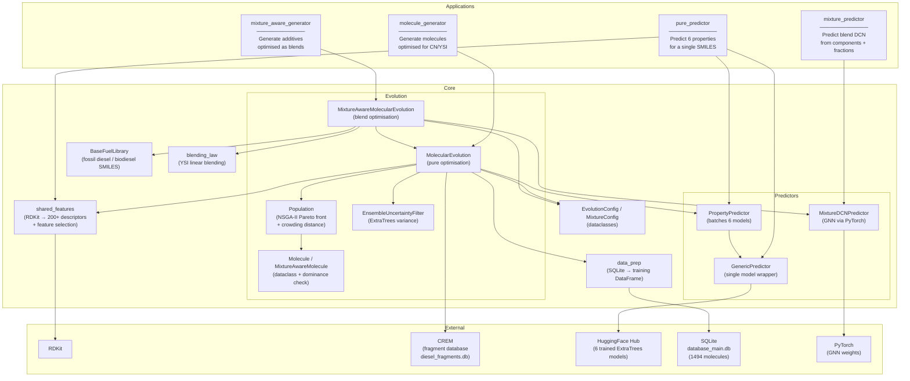
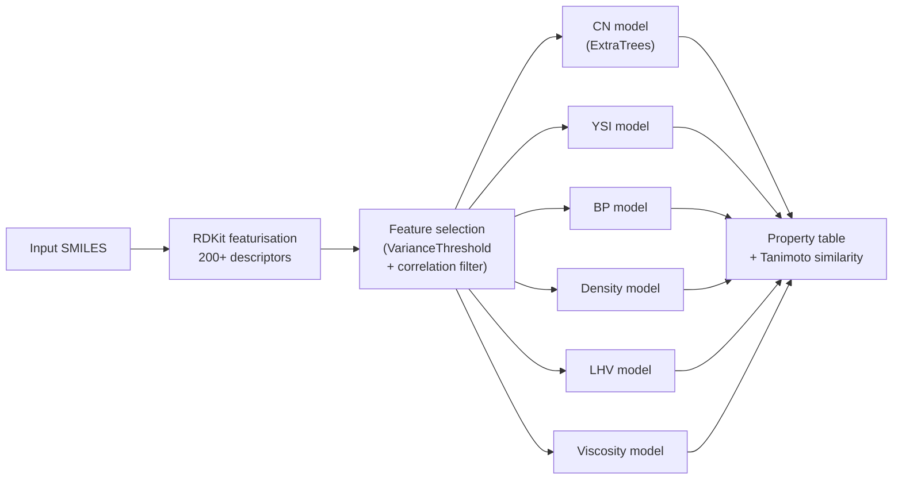
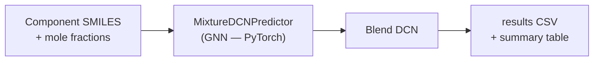

# System Architecture

## Application Layer

The system is split into four user-facing applications, each built on a shared `core/` library.

---

## Data Flow: Pure Component Prediction

---

## Data Flow: Mixture DCN Prediction

