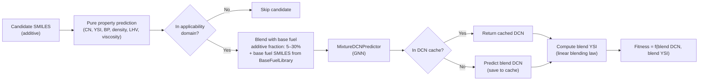
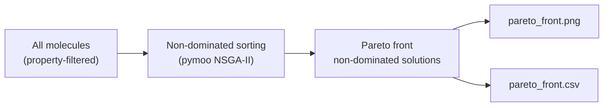

# Genetic Algorithm — Design and Flow

## Overview

The evolutionary optimiser generates novel biofuel molecules by iteratively mutating a population of SMILES strings, evaluating them with trained ML models, and selecting survivors using NSGA-II Pareto ranking. Two variants exist: **pure-component** (`MolecularEvolution`) and **mixture-aware** (`MixtureAwareMolecularEvolution`), which evaluates each candidate as a blend with a base fuel.

---

## Full Algorithm Flow

```mermaid
flowchart TD
    A([Start]) --> B["Load training data\ndatabase_main.db → 1494 molecules"]
    B --> C["Calibrate uncertainty filters\nsample 200 molecules from training set\nfit EnsembleUncertaintyFilter for CN and YSI\n(90th-percentile variance threshold)"]
    C --> D["Stratified initialisation\n30 CN bins × 20 samples = 600 candidate SMILES"]

    D --> E["Featurise\nRDKit → 200+ descriptors → feature selection"]
    E --> F["Batch predict properties\n(CN, YSI, BP, density, LHV, viscosity)"]
    F --> G{"Pass filters?"}

    G -->|"Tanimoto < 0.7\nor CN/YSI uncertainty too high"| DISCARD1[Discard]
    G -->|Pass| H["Add to population\n(deduplicated by SMILES)"]

    DISCARD1 -.-> D

    H --> I["Initial population ready\n~100 valid molecules"]
    I --> J[/"For each generation\n(default: 6 iterations)"/]

    J --> K["Log generation stats\n(best CN error, avg YSI, Pareto front size)"]
    K --> L["Select survivors\ntop 50% by NSGA-II rank\n+ crowding distance tiebreak"]

    L --> M["Mutate survivors\nCREM fragment substitution\nup to 5 mutations per parent\nfrom diesel_fragments.db"]

    M --> N["Featurise offspring batch"]
    N --> O["Predict all 6 properties\n(ExtraTrees — mean over all trees)"]
    O --> P["Compute uncertainty\n(std across ExtraTrees estimators)"]

    P --> Q{"Pass filters?"}
    Q -->|"CN/YSI uncertainty too high\nor Tanimoto < 0.7"| DISCARD2[Discard]
    Q -->|Pass| R["Add to new population\n(survivors + valid offspring)"]

    DISCARD2 -.-> M

    R --> S{"More generations?"}
    S -->|Yes| J
    S -->|No| T["Apply property constraints\nBP: 60–250 °C\nDensity ≥ 720 kg/m³\nLHV ≥ 30 MJ/kg"]

    T --> U["Sort by objective\n(min CN error or max CN)\n+ min YSI if enabled"]
    U --> V["Extract Pareto front\nNSGA-II non-dominated sorting\n(CN vs YSI trade-off)"]

    V --> W(["Output\nfinal_population.csv\npareto_front.csv\npareto_front.png"])
```

---

## Mixture-Aware Variant

When `mixture_mode=True`, the fitness evaluation step is extended:

---

## Key Parameters (defaults)

| Parameter | Value | Effect |
|-----------|-------|--------|
| `generations` | 6 | Number of evolution cycles |
| `population_size` | 100 | Molecules carried per generation |
| `survivor_fraction` | 0.5 | Top 50% selected as parents |
| `mutations_per_parent` | 5 | CREM mutations per survivor |
| `batch_size` | 100 | SMILES processed per prediction call |
| `uncertainty_percentile` | 90th | Threshold for filtering high-variance predictions |
| `tanimoto_threshold` | 0.7 | Min similarity to training set required |
| `additive_fraction` | 0.15 | Default blend ratio (mixture mode) |

---

## Pareto Front (NSGA-II)

The final Pareto front captures the trade-off between **maximising cetane number** and **minimising YSI (sooting index)**. Crowding distance is used as a tiebreaker to preserve diversity along the front.

